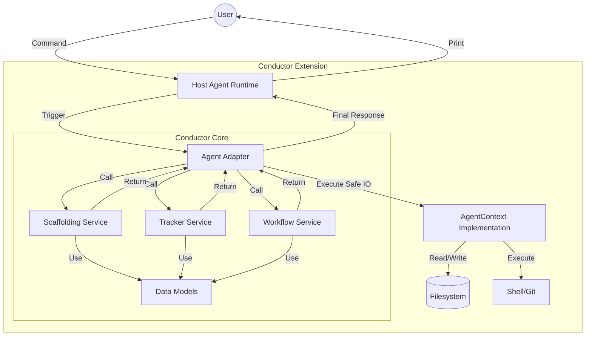

# POC Architecture Diagram: Universal Agent Interface

This diagram illustrates how the Conductor Core remains agent-agnostic by communicating through Adapters.

## 1. Interaction Flow
1.  The **User** invokes a command (e.g., `/conductor:setup`) in the **Host Agent**.
2.  The host agent triggers the corresponding **Adapter**.
3.  The **Adapter** translates the request and calls the appropriate **Conductor Core** service.
4.  The core service performs business logic using agent-agnostic **Models**.
5.  Any filesystem or shell interactions are delegated back to the **Adapter's** implementation of the **AgentContext**.
6.  The result is returned to the **Host Agent**, which displays it to the **User**.

## 2. Supported Agents (via Adapters)
-   **Gemini CLI**: Translates TOML commands to Core calls.
-   **Mistral Vibe**: Operates as an MCP server connecting to Vibe's MCP client.
-   **OpenAI Codex**: Integrates as a "Skill" and communicates via MCP.
